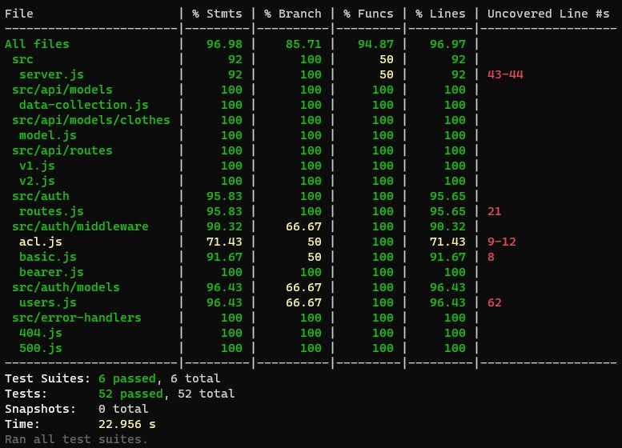
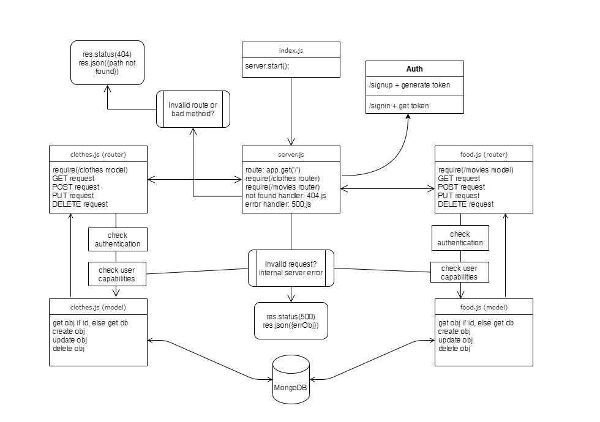

# LAB: Access Control

Authentication Server Phase 3: Role Based Access Control

**Author:** Afnan Damra
**Version:** 3.0.0

**Links:**

- [Repo Link](https://github.com/afnandamra/auth-api)
- [GitHub Actions](https://github.com/afnandamra/auth-api/actions)
- [Deployed Site](https://afnan-auth-api.herokuapp.com/)
- [PR Link](https://github.com/afnandamra/auth-api/pull/1)

## Setup

### Install

- Clone the repository from GitHub
- Run the command `npm i express dotenv morgan base-64 bcrypt cors mongoose jsonwebtoken fs jest @code-fellows/supergoose` to install dependencies
- create .env file with PORT variable and `MONGODB_URI=mongodb://localhost:27017/auth_2` and a secret key `SECRET=xyz`

### Test

- Run the command `npm test` to test and verify the server and the midddlewares are working.
- Run the command `npm run lint` for testing lint.

### Run

- Start the server using `nodemon`
- Visit http://localhost:PORT at the PORT number you've assigned in your .env
- put the [Heroku Link](https://afnan-auth-api.herokuapp.com/) inside this one [https://javascript-401.netlify.app/](https://javascript-401.netlify.app/), choose Module 3 (AUTH) / ACL, and have fun :smile:

## Documentation

### UML Diagram

Below is a UML of my application (created at https://app.diagrams.net)

## Resources

[Starter code](https://github.com/afnandamra/amman-javascript-401d7/tree/main/class-08/lab/starter-code)
